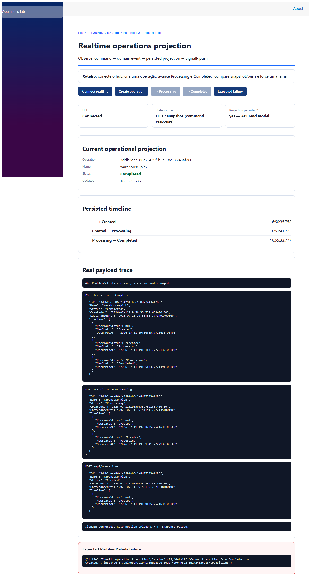

# Evidência do fluxo Blazor — 2026-07-11

## Ambiente

- API: `http://localhost:5308` (health check HTTP 200)
- Dashboard: `http://localhost:5408` (HTTP 200)
- Browser: Playwright CLI, Chromium local

## Roteiro executado

1. Abriu o dashboard e conectou o hub SignalR: card `Hub = Connected`.
2. Clicou **Create operation**: projeção `Created`, timeline com `— → Created` e payload HTTP real.
3. Clicou **→ Processing** e **→ Completed**: timeline persistida passou por `Created → Processing → Completed`.
4. Clicou **Expected failure**: a UI exibiu ProblemDetails HTTP 409, sem alterar o estado `Completed`.

O screenshot captura o painel ao fim do fluxo, incluindo a projeção, timeline, payloads e o ProblemDetails esperado.

## Observação de arquitetura

Os comandos exibem suas respostas como `HTTP snapshot`; o dashboard também mantém conexão SignalR e registra que reconexão exige nova leitura de snapshot, conforme ADR-0004. A persistência é realizada antes do adaptador de publicação no caso de uso, coberta pelo teste de aplicação.
