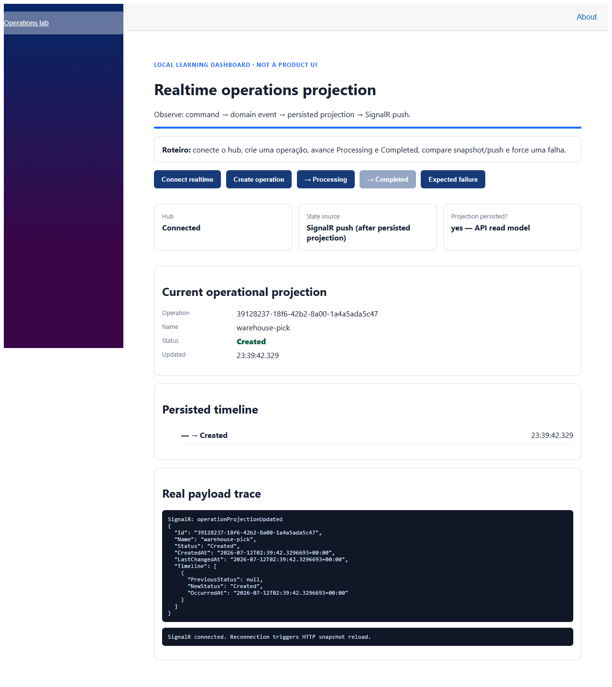

# Evidência de push SignalR — 2026-07-12

Dois painéis Blazor foram abertos via Playwright. O painel observador conectou primeiro ao hub; o segundo criou uma operação pela API. O observador exibiu `State source = SignalR push (after persisted projection)` e o trace registrou `SignalR: operationProjectionUpdated` com o payload real `Created`.

## Correção

O HTTP já serializava enums como texto, mas o protocolo JSON do SignalR mantinha o padrão numérico. O dashboard recebe status como texto; isso impedia a desserialização do payload. `AddJsonProtocol` agora usa `JsonStringEnumConverter`, alinhando ambos os contratos.
